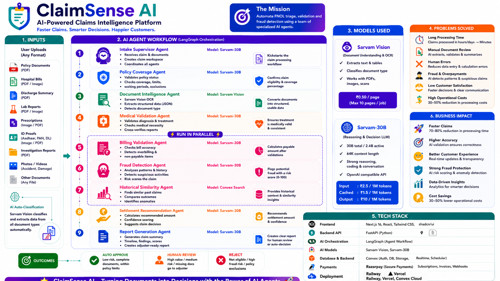

# ClaimSense AI

### AI-Powered Insurance Claims Intelligence Platform



Transform insurance claim processing with a 10-agent AI pipeline that reads documents, validates policies and medical/billing evidence, scores fraud risk, searches historical precedent, recommends a settlement, pauses for human sign-off, and generates an adjuster-ready PDF — in minutes instead of days.

**Live demo:** [claimsense-ai-rust.vercel.app](https://claimsense-ai-rust.vercel.app/) · **API health:** [claimsense-ai-production.up.railway.app/api/v1/health](https://claimsense-ai-production.up.railway.app/api/v1/health)

---

## The problem

Traditional insurance claim processing relies on manual document review, slow approvals, error-prone settlement math, and inconsistent decisions — driving up costs and customer wait times. It's also opaque: reviewers rarely get a consistent, auditable trail of *why* a claim was approved, flagged, or escalated.

ClaimSense AI automates the repetitive parts of the First Notice of Loss (FNOL) pipeline — OCR, policy coverage checks, medical/billing validation, fraud scoring, precedent search, deterministic settlement math (deductible, copayment, sum-insured cap) — while keeping a human claims officer as the final decision-maker for every claim, not just the edge cases. Nothing is auto-finalized: the AI proposes, a person disposes, and the reasoning behind both is preserved in the generated report.

## How it works

A 10-agent [LangGraph](https://www.langchain.com/langgraph)-orchestrated pipeline, each agent responsible for one step and passing structured output to the next:

```text
User Upload
    │
    ▼
Document Intelligence (OCR)  →  Intake Supervisor  →  Policy Coverage  →  Medical Validation
                                                                                │
                                                ┌───────────────────────────────┼───────────────────────────────┐
                                                ▼                               ▼                               ▼
                                        Billing Validation                Fraud Detection            Historical Similarity
                                                │                               │                               │
                                                └───────────────────────────────┼───────────────────────────────┘
                                                                                ▼
                                                                 Settlement Recommendation
                                                                                │
                                                                                ▼
                                                                    Human Approval (pause)
                                                                                │
                                                              Claims officer: Approve / Reject / Modify
                                                                                │
                                                                                ▼
                                                                     Report Generation (PDF)
```

**The 10 agents:**

| # | Agent | What it does |
|---|---|---|
| 1 | **Document Intelligence** | OCRs every uploaded document (policy PDF, discharge summary, prescription, lab report, hospital bill, ID proof, etc.) via Sarvam Vision |
| 2 | **Intake Supervisor** | Routes the claim through the pipeline and tracks workflow state |
| 3 | **Policy Coverage** | Validates coverage, extracts sum insured, deductible, and copayment terms |
| 4 | **Medical Validation** | Cross-checks diagnosis and treatment against discharge summaries, lab reports, and prescriptions |
| 5 | **Billing Validation** | Itemizes and validates hospital bill line items, computes the payable amount in code (never trusting model arithmetic) |
| 6 | **Fraud Detection** | Scores fraud risk 0–100, checks narrative-vs-medical-evidence consistency |
| 7 | **Historical Similarity** | Semantic vector search (Qdrant Cloud) against previously completed claims |
| 8 | **Settlement Recommendation** | A deterministic rule cascade (not an LLM call) — deducts deductible/copayment, caps at sum insured, bands the outcome by fraud score |
| 9 | **Human Approval** | Pauses the graph (LangGraph `interrupt()`) and waits for a claims officer to Approve / Reject / Modify the AI's recommendation |
| 10 | **Report Generation** | Renders a multi-section adjuster-ready PDF with both the AI's recommendation and the officer's final decision |

Settlement, Historical Similarity, Report Generation, and Human Approval are deliberately **non-LLM** — a fixed rule cascade, local vector search, PDF templating, and a graph pause, respectively. This is a hybrid architecture chosen for auditability in a regulated domain: LLM auto-approval is a black box, so the money math and the final decision are deterministic and human-owned, not model-generated.

Full architecture and per-agent responsibilities: [`insurance agent.txt`](./insurance%20agent.txt). Visual reference: [`claimsence.png`](./claimsence.png).

## Tech stack

| Layer | Technology |
|---|---|
| Frontend | Next.js 16 (App Router), React 19, Tailwind CSS v4, shadcn/ui, TypeScript |
| Backend | FastAPI, Python ≥3.12 (`uv`), LangGraph + LangChain, Pydantic, fpdf2 (PDF generation) |
| AI models | **Sarvam-30B** (reasoning — Policy, Medical, Billing, Fraud agents) · **Sarvam Vision** (OCR/document intelligence) |
| Database & Auth | Convex (Postgres-like DB, Convex Auth — Password + Google, File Storage, LangGraph checkpointing) |
| Vector search | Qdrant Cloud + FastEmbed (`BAAI/bge-small-en`, local ONNX embeddings) for Historical Similarity |
| Payments | Razorpay (test-mode Free/Pro/Plus usage-gated pricing) |
| Deployment | Vercel (frontend), Railway (backend, Docker build from root `Dockerfile`) |
| CI/CD | GitHub Actions (frontend lint + build, backend `pytest`), branch protection ruleset on `main` |

## Problems this solves

- **Slow, manual FNOL review** → OCR + structured extraction across every document type in one pass
- **Inconsistent coverage/medical/billing checks** → the same reasoning prompts run identically on every claim
- **Untrustworthy AI arithmetic** → payable amounts, deductions, and fraud levels are always computed in plain Python from the model's structured output, never trusted as model self-arithmetic
- **Black-box auto-approval** → Settlement is a fixed, readable rule cascade, not a 5th paid model call, and nothing finalizes without a human decision
- **No memory of past claims** → real semantic search (Qdrant) surfaces similar historical claims for context, not keyword matching
- **Losing claim state on redeploy** → claim/document metadata, uploaded files, generated reports, and LangGraph checkpoints all live in Convex, not process memory or local disk

## Project status

🚀 **Both stacks are live and functionally complete for the core pipeline.**

- ✅ Full 10-agent LangGraph pipeline, live-verified against real Sarvam API calls, a real Qdrant Cloud instance, and a real synthetic claim packet
- ✅ Human Approval stage — the pipeline pauses via `interrupt()` after Settlement and waits for an officer's Approve/Reject/Modify decision before generating the report (network-free verified; not yet re-run against a live Sarvam claim end-to-end)
- ✅ Convex-backed persistence — claim/document metadata, uploaded files, generated PDF reports, and LangGraph checkpoints all survive a backend restart/redeploy
- ✅ Frontend: marketing site, Convex Auth (Password + Google), full claim submission flow (create → upload → process → approve → report), Razorpay test-mode pricing gate, `/ai-agents`, `/solutions`, `/contact` pages
- ✅ GitHub Actions CI (lint+build, pytest) gating `main` via a branch protection ruleset
- ⬜ Live, click-through end-to-end verification of the deployed Vercel + Railway pair (currently verified via unit/integration tests and separate live API calls, not one real browser session start to finish)
- ⬜ Real auth-backed role separation — today's Human Approval uses a self-approval demo pattern (same signed-in user plays claimant and officer); no role system exists yet
- ⬜ No auth on backend endpoints — anyone with a `claim_id` can call the API directly; access control is frontend-side only today

## What this is (and isn't)

This project targets **production-grade engineering patterns on demo-scale/synthetic data** — clean multi-agent orchestration, structured outputs, human-in-the-loop escalation, and auditable decision trails. It is **not** a certified, regulator-approved production insurance system: real-world deployment would additionally require regulatory compliance (IRDAI/HIPAA-equivalent), audited medical/fraud decisioning, legal review of auto-approval logic, and real claims data. The goal is a credible, end-to-end demonstration of how modern agentic AI systems are architected for this domain — not a drop-in replacement for insurer infrastructure.

## Repository layout

```
backend/               FastAPI + LangGraph backend (see backend/CLAUDE.md)
frontend/               Next.js 16 + Convex frontend (see frontend/CLAUDE.md)
insurance agent.txt     full product/architecture specification
projectfolder.txt       backend folder-structure planning doc
claimsence.png          architecture/design poster
infographicclaimsense.png  README hero image
```

## About the developer

ClaimSense AI is built and maintained by **Narendra**.

- 📧 Email: [narendra.adp@gmail.com](mailto:narendra.insights@gmail.com)
- 🌐 Portfolio: [buildflows.shop](https://buildflows.shop/)
- 💼 LinkedIn: [linkedin.com/in/nk-analytics](https://www.linkedin.com/in/nk-analytics)

More shipped AI SaaS projects are showcased on the app's own [`/contact`](https://claimsense-ai-rust.vercel.app/contact) page.
